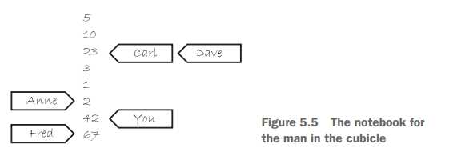

Parallelism is a form of concurrency
Context switching is also a form of concurrency, but it is "virtual", in the sense that it is acheived by fast switch, but in reality, at small enough fractions of time, there is no concurrency, just a single thread running each time

Inter process paralelism: Even though your app does not support multithreading, the OS can parallelize your only thread from your process with other threads of other processes, running two "processes" at the same time. 

You can paralelize instructions or data. Paralelizing instructions means dividing the necessary work into different threads, shortening the time taken to execute the amount of instructions to be run

If you paralelize data, then you are effectively processing a large ammount of data into multiple small chunks. Instead of processing 4 numbers linearly, assign 4 threads (or two or three or whatver you want) to each process 1 number individually.

Another option is, instead of processing individually, just assigm threads to process multiple SETS of data (1 thread to 4 numbers, another to another 4)

You can also use paralelism for separation of concerns. Two actions who are independent can be run on different threads, not particularly for efficiency purposes, but just for responsibility ones. The event loop and the rendering of a program for example

About std::thread: 
You can pass arguments of the callable object as arguments of the std::thread function 
Std::thread(callable, param1 of callable...)
You can even pass a method of a class by passing a pointer to method, and the object as the second arg. 
Pointer to method is the same as pointer to function, but it needs the namespace and parentheses on the name -> T (X::ptrMeth*)(G a, H b)

Threads copy the parameters you pass them, save them locally and then transfer ownership by moving their values to the callable you specified by using move, so that means that values you pass are not actually passed as named values, but rather rvalues.
std::thread(callable, int x, int y) Will actually do callable(std::move(x), std::move(y)), which means that if callabke expected x to be a reference, this will give a compilation error, as you can't create a reference from an rvalue (ofc, it doesn't have an address to reference). Keep in mind for operations when passing.

NVRO (Named Value Return Optimization), hace que devolver un local de una funcion sea directamente sustituir el valor en la función. Es especialmente importante entenderlo para threads, por que si creas un thread en una función y lo devuelves, realmente no necesitas moverlo en el return. El compilador lo hace por ti al optimizar, y si no puede, implicitamente lo devuelve como move

Threads are move-only, which means that you can't have multiple std::thread managin the same phisical thread. You can transfer ownership from one thread to another by using std::move

rvalues, lvalues:

Crear + lvalue  → copy ctor -> se espera deep copy 
Crear + rvalue  → move ctor 
Existe + lvalue → copy assign -> se espera deep copy y return una ref a la clase (*this)
Existe + rvalue → move assign -> se espera delegar el lifecycle del objeto a la clase y devuelve una ref (*this)
Crear sin args  → default ctor
Muerte          → destructor

The compiler treats them differently, because it can generate them automatically on compilation time, or even delete them. The rest of methods (even if they are also constructors or operators) are NOT special. You might define them for convenience. 
 

Thread IDs are opaque ids of the OS thread id. They only guarantee is that, at any moment in the execution of a process, it's running threads have unique IDs between them. THE REST (uniquenes of thread IDs amongst processes, uniqueness of thread Ids amongst the same process in terms of time, total or partial ordering between them...) is not guaranteed. The main thread is not treated differently, and in terms of ID it is indistinguishable from the rest. 
std::this_thread::get_id

Data sharing in multithreading peogramming:

Read-only data is no problem between threads. Two threads reading a data adress at the same time is allowed, as it does not change the visible state of the shared resource.

The main problem with multithreading is the data shared between threads. Invariants are often related. If you have a data structure that guarantees that a condition X is held whilst there are no changes to that ds, but you try change a value, ir delete one for example, multiple threads accesing that information might end up sith incorrect information or state, which eventually leads to crahses or bugs. Synchronizing these acceses and making sure the state of the shared resource is always predictable is the main concern when multithreading.
Race conditions are inherent to real concurrent, non read-only processes. If two threads change the contents of a memory address, REGARDLESS if it is done securely via a semaphor o mutex, then that situation is a race condition, because the order in which that direction is changed matters. The problem is not with the fact that there are race conditions, because those are inherent to concurrent systems, but the fact that provoking them without the correct security will create data races. 

mutexes: They are one mechanism for protecting against data races. They act similarly as binary semaphores, but the operations are opaqued behind the operations lock() and unlock(). When a thread calls mutex.lock(), if no other thread is currently locked with the mutex, then it is free to pass through, without getting blocked. Otherwise (if a process is already locked with the mutex), then the calling thread will get blocked until the mutex gets unlocked. 
As in joining_threads, you have a useful wrapper that ensures RAII, which is called std::lock_guard<std::mutex>yourguard(yourMutex); (probably used also for other structures). When declaring the lock_guard, the constructor calls lock ON THE MUTEX you passed. It does not take ownership (like joining thread, which managed its lifecicle), but rather just has a reference to that mutex, so it only acts over it. 

Working with data guarded by a single mutex is out of the way. But what happens when an operation requires data that is encapsulated by various mutexes? Imagine, for example, you want to swap to data structures (maybe two vectors). 
You will have a method (probably called swap) which takes both, and then swaps it's attributes. The problem is that you now have two different memory addresses you want to acces, both with it's own mutexes. You think of calling first lock on the mutex A, and then lock on the mutex B. But what can happen is that in the middle of the call to A.lock() and B.lock(), another thread might call B.lock() and then A.lock():

1 - A.lock()
2 - B.lock()
1 - B.lock() -> thread 1 is now blocked until 2 unlocks B
2 - A.lock() -> thread 2 is now blocked until 1 unlocks A
deadlock

how to avoid this? leaving the responsibility to the compiler to get assured that we always get both A and B locked. This is done by using the std::lock() structure. Internally it does a iterative process of try-lock and rollback of both until it gets the locked mutexes.
Now, it's just a matter of giving the responsibilty of unlocking the mutex to a lock_guard (by specifying that the mutex is already locked, that it's single responsibility is to unlock it once itself goes out of scope):

void swap(T& first, T& second){
   if(&first == &second){
      return; // this because if it is the same instance, we would be double locking the 
     //mutex that guards it, which is UB
   }
   std::lock(first.mutex, second.mutex);
   std::lock_guard<std::mutex> a(first.mutex, std::adopt_lock); //tell lock_guard he doesnt need to lock the mutex
   std::lock_guard<std::mutex> b(second.mutex, std::adopt_lock);
   //now we are thread safe to do whatever we need

}
One thing to mention is the fact that std::lock can throw. If it does, it releases any of the locks (if it had) on both mutexes. This way, the std::Lock ensures all or nothing. Either you get the desired result, or both mutexes are freed and an exception is thrown, which then propagates up, cutting the function execution. If we get past the std::lock is because we succefully owned both mutexes. Then it is a matter of RAII with std::Lock_guard and then operating.
std::lock_guard can't throw if it only adopts the mutex (this case), so we are safe.

There is a useful alternative, which is the std::unique_lock template. It takes the mutex, and you can specify a second parameter. either std::adopt_lock, which takes the management of the mutex that is already locked (like using lock_guard with adopt_lock), or std::defer_lock, which does not try to lock the mutex on construction and either assumes it is locked. It is a lazy RAII, because it also won't try to unlock it. But for this, it needs an additional runtime check, which is to check an internal state (like an atomic boolean) that states wether if the internal mutex is locked or not. Note that this check is not needed when using a normal lock_guard, because in construction we either get assured the mutex is locked or the constructor locks it. Then the lock guard can't chnge the state of the mutex, so in destruction the mutex is ALWAYS locked. Then it is a matter of unlocking it. The problem with unique lock is the fact that throught the lifetime of the unique_lock, the invariant of the state of the mutex is not assured, so we might get to the destruction of the unique_lock, and the mutex is still unlocked, so an additional check is needed.

once_flag y call_once. 
Cuando tienes un recurso cuya inicializacion necesita sincronizacion, necesitas que los estados entre inicializar y leer la inicializacion sea unico. Me explico. Imagina que tienes un lazy inicialization de un recurso. Solo cuando realmente se necesita, se inicializa. Eso genera un estado en el que recurso puede no ser valido. Por eso necesitas una comprobación. Si el recurso no se ha inicializado, entonces es el propio thread el que lo inicializa. Para ello necesitas sincronizacion, por que esa comprobacion inicial y luego inicializacion deben ser sincronizados entre threads, si no puedes tener data races. El primer pensamiento es tener un mutex que bloquee tanto la comprobación (lectura) como la inicializacion (escritura). El problema es que, aunque ya se haya inicializado el recurso (de manera segura gracias al mutex), cada vez que un thread necesita operar sobre el recurso, debe pasar por el mutex. Eso serializa (genera comportamiento lineal) de los threads, por que aunque hayan varios threads intentanto actuar en paralelo sobre el recurso, todos deben esperar a que el mutex esté unlocked para poder comprobar el estado. Esto le quita el sentido al acceso concurrente del objeto. Una opcion es lo que se conoce como double check.
if(!resource){
  std::lock_guard<std::mutex>{mutex};
  if(!resource){
    initialize(resource);
  }
} 
resource->operate();

Evitas el overhead que tiene usar un mutex sin importar si el recurso esta o no inicializado. El problema es que la operacion de lectura (!resource inicial) y la operacion de escritura (initialize(resource)) no estan sincronizadas. Thread 1 puede estar leyendo el estado mientras que otro lo esta cambiando, lo que puede generar corrupcion de los datos (acuerdate de las condiciones de data race: accesos concurrentes a la misma direccion, con minimo 1 de ellos escritura, sin proteccion o jerarquia de happens-before). Esto es un data race en la inicializacion de manual (aunque luego a los accesos ya no lo sea, por que una vez que se inicializa, suponiendo que ha habido suerte y se ha hecho correctamente ya no se vuelve a entrar al if). 
Para no tener el overhead del mutex pero evitar data races, una opcion es tener una flag de check global. 
Es decir, en la intitializacion, los threads se pelean por ver quien es el que inicializa el recurso. Una flag global (once_flag) inicialmente NO inicializada, es la que los threads comparan con un estado esperado (recurso no inicializado). La operacion de comparar la flag para ver si hace falta llamar al callable, luego si no lo está cambiar la flag para que otros threads la vean en sus comparaciones (CAS - Compare And Swap) es ATOMICA. Esto significa que solo UN THREAD va a ver la flag en el estado no inicializado (el primero que llegue). El resto, solo van a ver el estado de inicializandose (donde se bloquean) o inicializada (vuelven de la call a call_once). De esta forma, la comparacion se hace con una flag que actua como boton. Inicialmente, el boton no está pulsado. El primer thread que llegue pulsa el boton. Los otros threads que tambien querian pulsarlo, esperan a que el boton esté totalmente presionado (esos threads esperan haciendo spin o wait) . Una vez que el recurso (o la call) se ha terminado, entonces se despierta a los que estaban esperando a inicializarse. De ahi en adelante cualquiera que llegue va a ver el boton pulsado, lo que implica que el recurso hya esta disponible. Esto limita el overhead solo en la inicializacion (a diferencia del mutex, donde era en toda la ejecucion, sin importar el estado del recurso), y evita data races en el momento de la inicializacion, gracias a que CAS es atomica. 

Read-writer operations:
The standard provides with an implementation that is useful for read-write operations. Imagine you have got two operations on a single object. One is read-only (observer) and the other is write (updater). We want to provide concurrent acces for readers, as their state does not depend on the others, and the resource is not being updated. The problem is that, when a writter wants to update the object, it must do so exclusively. No readers can access the resource or else they might see an invalid state. For this, the std::shared_mutex is provided. It is a mutex that supports both shared operations and single operations. The difference with std::mutex is the fact that std::shared_mutex supports both operations, but with restrictions. With std::mutex, access is exclusive. Only one thread can enter the lock, and if anyone else tries to access it, they get blocked. When the thread inside ends, the mutex gets unlocked, and the next can enter. In shared_thread, a thread can enter in READ MODE (method shared_lock()) or in UNIQUE MODE (method lock()) but the UNIQUE MODE is not the same as in std::mutex. The general implementation for the shared_mutex is to give priority to the writters. This mens that if there are multiple threads in read mode with the mutex and a write thread enters, it will REQUEST the lock in exclusive mode with the call to lock() (or by passing the std::shared_mutex instance to a unique_lock or lock_guard, which will RAII the lifecycle). The compilers generally block other readers from entering if there is a writter waiting. This is to avoid writter starvation. Once there are no readers in the lock, the writter acquires the lock in exclusive mode, just like in regular std::mutex. Note that it is the same behavior ONLY when the thread has the lock, but not when it is waiting. When the writter thread finishes, it release the lock, making able to other threads to enter. Most of the conventions are implementation dependent, as the standard does not specify. The only thing that the standard guarantees is the fact that the readers are concurrent, and the writter is exclusive. Locking with lock_guard or unique_lock will request an exclusive lock (for example, the standard does not specify who has priority on this case, but the general aproach for the compilers is to prevent writer starvation by giving them priority and preventing new readers to enter).
Just to recap:
std::mutex - only supports exclusive operations 

std::shared_mutex - can be called for shared and exclusive operations (this last don't behave the same as exclusive operations from std::mutex)

std::unique_lock<> - can only call exclusive operations *No invariant: mutex can change state on lifecycle. Keeps the state with a flag that hints on locked or not. In fact, implements wrappers for lock() and unlock() for the underlying mutex. Can be moved across scopes.

std::lock_guard<> - can only call exclusive operations *Assumed invariant: mutex state cannot change. Locked on constructor (or aquired lockness) and destroyed on destruction. Lockness is uninterrupted for the lifetime of the wrapper. Non-movable, non-copyable. Creates destroys on the same scope. 

std::shared_lock<> - can only call shared operations. Movable

you might implement a hierarchicall mutex, using an internal ordering.
Joining threads
call_once
once_flag
std::lock to aquire multiple (MULTIPLE, not just 2, but for simplicity we talk about 2) locks with an all or nothing aproach. The specific order is not guaranteed. Might lock 1 then 2 or in reverse. The important is that you either get them both or none (Imagine for a swap operation. Two different Mem Addr, so two locks but might get deadlock if you try to aquire 1 while holding the other. Another thread might do the oposite to you, both asking for the opposite lock -> deadlock). Internally its a try_lock or rollback game. 
condition_variable
std::async
std::promise
std::future
std::shared_future
std::packaged_task

Keywords:
RAII, NVRO, CAS, Invariant, Exclusive, Reader Writter, Race Condition, Data Race and it's 4 conditions, Rollback, Memory Model, LL/SC, Magic Statics, SIOF (Static Init Order Fiasco), ODR

Syncronization between threads:
The previous is just mechanisms to ensure no data races ocur, or at least control the scenarios where it can ocur. But what happens when you need to do an operation on a thread that is specting a result from another thread? for example, an operation of the second is used in the first thread.
In this cases what you need, apart from mutual exclusion mechanisms, is also syncronization between them, so that when thread 1 finishes it's chore, thread 2 know it can access the results of the first thread. 
This can be done, in a very raw manner, with a spin loop. A condition is checked constantly inside a loop until it is true:

while(!condition()){
   mutex_protecting_shared_resource.unlock();
   std::this_thread::sleep_for(X ms);
   mutex_protecting_shared_resource.lock();
}

we lock the mutex when checking the condition, and unlock it when giving time for the other thread to finish it's job. 
This is a wasteful manner to do things, as we are wasting computation in constantly checking. We are also blocking the job thread from posting the results if we happen to be owning the lock when it finishes. For this, condition_variables are pretty useful.

std::condition_variable is a mechanism that allows for sync between one or multiple threads using the same condition_variable instance. On one end, the thread that expects the result will wait (cond_var.wait()) until the working thread notifies (cond_var.notify_one()) him to wake up. Both act upon a lock (must be a unique_lock over the mutex, because the condition_cariable must be able to freely lock or unlock the mutex). The waiting thread, if waken up, will try to aquire the lock. When it does, it will optionally check for a condition to be true (if we are using the overloaded version that takes a callable as second parameter). If the condition is not true, then the thread will be put to sleep again (while(!cond){ wait(lk); } this is the declaration of the overloaded method: wait(lk) is the single version, so really predictable). Note that the thread gets put to sleep by the OS, unlocking the mutex associated, and it only tries to reacquire the lock once it gets waken up.
std::condition_variable_any is a more general object that serves the same purpose for our use case.

Another mechanism for when you want once-only checks is futures and async.
an std::async(callable, args) returns a std::future<T>, where T is the return type of the callable you passed to async. That task is run asynchronously. When you eventually need the result, you call get(). Depending on how you want the async to work, you might pass aditional policy parameters before the callable, part of 
the std::launch namespace. If you pass std::launch::deferred, the callable will run when calling get o wait. If you specify std::launch::async, it will run on a separate thread. Specifying both or none is the default, and the implementation chooses.

The previous is all cases where you wait an unspecified ammount of time, until waken up or spuriously done so. If you need to wait for a spceified amount of time, the
functions usually have two additional functions. The ones adding a "_for" handle timeouts based on duration (wait for 30 ms). The ones having "_until"
specify timeouts based on absolute time (20 november UTC and so)

keywords:
CSP (Comunicating Sequential Processes), FP (Functional Programming)...

The way you structure code can potentially enable it to run concurrently without the need for lock mechanisms or happens-before. Functional Programming
enables you to implement this in a very simple manner. If each component (function) acts with a closed state (it takes an input and generates an output,
without changing any external state), then it is really easy to implement concurrent tasks, because the result of 1 thread can be the input of another,
and as they don't share resources, it's state is independent. 
Another programming style, CSP (Comunicating Sequential Processes), aims to run concurrent tasks with completely isolated states. You have actors (tasks, threads)
that act on messages. The actors have completely isolated states: no shared memory, no access to other actors... Actors comunicate with channels, like pipes. 

Following with sync mechanisms:

std::lach and std::barrier.

A shared lach between threads can be viewed as a shared counter. 
A latch starts off with X count. the method lach.count_down() decrements that counter. It can be called by any thread, any number of times. 
Other threads can wait with the method latch.wait() to the latch to reach 0 or not (they can just call count_down, which decrements the counter,
without blocking themselves). When the counter reaches zero, the threads that were blocked by the call to wait() get released. The latch is not
reusable, so once the counter reaches zero, the latch becomes invalid.
The methods are:

void count_down(ptrdiff_t n = 1) noexcept;
bool try_wait() const noexcept;
void wait() const;
void arrive_and_wait(ptrdiff_t n = 1); // equivalent to count_down(n) + wait(), but atomic

try_wait is non_blocking, and returns true if the latch has reached zero, and false otherwise.
wait will block the execution of the thread until the latch has reached zero.

For the barriers, it is a similar case, but barriers are REUASABLE. The interface is the following:

explicit barrier(std::ptrdiff_t expected, CompletionFunction completion = CompletionFunction());

arrival_token arrive(std::ptrdiff_t n = 1);
void wait(arrival_token&& tok) const;

void arrive_and_wait();
void arrive_and_drop();

the barrier is a reusable latch, where everytime the barrier completes, it gets reset again. Barriers are a little more strict than latches,
in the sense that they are symbolic. Barriers are usually used as checkpoints, where one thread might call arrive when it has reached a certain
point in the code. Then, it can call wait with the same token that returned arrive (or you can directly call arrive_and_wait, which combines both calls).
The thing is that wait blocks the thread until the phase specified by the token you pass is completed (meaning that the barrier has reseted again).
This is why calling arrive more times that what you specified WITHOUT WAITING for the phase to finish is UB. The way to know if a phase is finished
is to call wait with the token of the phase (or arrive_and_wait()), because the thread will get waken up once it is safe to call arrive again (because the 
phase has changed). 
Optionally, every time a phase ends, a completion function can be called (specified in the constructor of the barrier). Which will run once every time 
the barrier reaches the expected number of threads that have arrived. 

Atomics and the memory model:

The C++ memory model distinguishes objects and memory locations. In short, everything that has a lifetime, address or any identifiable trait and occupies a space is an object (classes, enums, namespaces, typedefs... are not objects). A struct variable is an object itself, composed of other objects (subobjects). A variable of
a fundamental type is also an object. An object must occupy at least one memory location. Fundamental types like int, char... ocupy exactly one memory location. Bit fields that are adjacent live in the same memory location.

Atomic operations are indivisible operations. They are not composed of multiple steps. To the eyes of an obeserver, an atomic operation is either not done or done. 
It is important to note that single atomic operations itself are indivisible, but if you chain them the process is not atomic (as expected). You can distinguish steps,
even if they individually are atomic. 

Memory ordering is an important concept in concurrency.
If you post a result, what guarantees that all of the threads will have the same expected result? Results are not posted univerally and automatically, even if you are using atomics.
One thread might be in a valid state, but unsynchronized with another.
Imagine you have a variable X.
int x = 0
Thread A does x = 2
Thread B does x = 1
Thread C reads from X
thread D also reads from x. 
With atomics the following problems arises. Which order does each thread see? Thread C might see x in the state where it is zero, 1 or 2. Thread D could see 2 and then 1.
There is no ordering that states: "if A has happened, then so does B". Operations that are previous to the operation A may not be seen by thread X. 

For this, atomics have different level of contracts for their operations, in order to establish different levels of guarantees for what happens between operations. 
There are three fundamental operations: 
- Load
- Store 
- Read-Modify-Write (RMW)

Store operations store values on memory addresses (variables).
Load operations retrieve values from memory addresses (variables)
Read Modify Write, as the name states, read from a memory address, perform an operations on it (add, compare, exchange) and store them on the same memory address.
Some RMW might not write back, but are still considered RMW. 

There are 6 levels of memory order:
aquire
release
relaxed
acq_rel
consume
seq_cst

Load supports the following memory orders: aquire, relaxed, consume, seq_cst
Store operations support: release, relaxed, seq_cst
RMW operations support: all of them

The fundamental rule for consumer producer (aquire, release operations):
Si un acquire observa el efecto de un release sobre el mismo atomic,
entonces todas las operaciones anteriores al release
son visibles después del acquire.

lock(acquire)
unlock(release)

the fundamental atomic type is the std::atomic_flag. It is initialized as std::atomic_flag f = ATOMIC_FLAG_INIT;
It supports two operations: test_and_set, which is a RMW operation

Operation                         atomic_flag   atomic<bool>   atomic<T*>   atomic<integral-type>   atomic<other-type>

test_and_set                          Y
clear                                 Y
is_lock_free                          Y             Y             Y                  Y                      Y
load                                                Y             Y                  Y                      Y
store                                               Y             Y                  Y                      Y
exchange                                            Y             Y                  Y                      Y
compare_exchange_weak,
compare_exchange_strong                             Y             Y                  Y                      Y
fetch_add, +=                                                     Y                  Y
fetch_sub, -=                                                     Y                  Y
fetch_or, |=                                                                         Y
fetch_and, &=                                                                        Y
fetch_xor, ^=                                                                        Y
++, --                                                            Y                  Y

Keywords: happens-before, inter-thread, transitive relations, strongly-happens-before y meory order consume, syncronizes-with, sequence-before

sequence-before has to do with single threads. If thread A executes the instruction A and then the instruction B (sequentially), then A sequences-before B. At multithread level,
if thread A executes instruction 1, then thread 2 executes instruction 2 and both instructions are suitaby tagged (for example, aquire, release).

Modelo de memoria en C++ — Resumen conceptual
1. Memoria compartida ≠ observación compartida

Que una variable esté en memoria compartida no implica que todos los threads vean el mismo valor al mismo tiempo ni en el mismo orden.
Cada thread observa una proyección local del estado del programa, influida por:

reordenamientos del compilador

buffers de escritura

cachés privadas

ejecución fuera de orden del hardware

El modelo de memoria de C++ define qué observaciones son legales, no cómo se implementan.

2. Qué garantiza std::atomic

Un std::atomic<T> garantiza:

atomicidad (no valores rotos)

ausencia de data races

un modification order total por cada objeto atómico

Pero NO garantiza por sí solo:

visibilidad inmediata entre threads

orden relativo con otros atomics

una historia global compartida

La sincronización debe pedirse explícitamente.

3. Relaciones fundamentales del modelo
3.1 sequence-before

Orden dentro de un mismo thread

Total y siempre existente

No cruza threads

3.2 synchronizes-with

Relación explícita entre threads

Ocurre cuando:

un store(release) es leído por un load(acquire)

o con mutexes, fences, seq_cst

Siempre induce happens-before

3.3 happens-before

Relación lógica final

Garantiza:

visibilidad

ausencia de data races

Es transitiva

Se construye a partir de:

sequence-before

synchronizes-with

4. Acquire / Release: qué hacen y qué no hacen
Qué SÍ hacen

Permiten publicar estado (release)

Permiten consumir estado (acquire)

Crean relaciones puntuales y dirigidas

Son transitivos

Qué NO hacen

No crean orden global

No obligan a que todos los threads vean lo mismo

No sincronizan atomics distintos

No imponen una historia única

Acquire/release sincroniza pares, no el sistema entero.

5. seq_cst: orden total global

memory_order_seq_cst añade una garantía extra:

Todas las operaciones seq_cst participan en un único orden global total

Todos los threads observan la misma historia

Es más fácil de razonar, pero más restrictivo (y potencialmente más caro).

6. Modification order

Para cada objeto atómico individual existe un modification order:

Es un orden total de todas sus escrituras

Si dos escrituras están sequence-before en el mismo thread, ese orden es obligatorio

Si vienen de threads distintos, el orden puede variar entre ejecuciones

Un load(acquire):

lee una escritura permitida del modification order

sincroniza solo con la escritura cuyo valor lee

no elige “la más nueva” salvo que esté obligado por orden previo o seq_cst

7. Múltiples releases y acquires

Un release puede ser consumido por múltiples acquire

Un acquire sincroniza con un solo release (el que lee)

Si los releases vienen del mismo thread, el más nuevo gana

Si vienen de threads distintos, el acquire puede ver cualquiera

8. Por qué los threads pueden “disagree”

Incluso con atomics:

no hay orden global implícito

distintos threads pueden observar escrituras en órdenes distintos

la coherencia no impone orden entre variables distintas

El desacuerdo no es un bug, es un comportamiento permitido.

9. volatile NO es sincronización

En C++:

volatile solo impide optimizaciones del compilador

no crea happens-before

no fuerza propagación entre cores

no impone orden inter-thread

Leer varias veces una variable volatile no garantiza ver un write reciente de otro thread.

10. Idea clave final

El orden no es una propiedad del programa, sino de la observación de cada thread.
La sincronización explícita es lo único que crea acuerdo entre threads.

Acquire/release crea acuerdos locales.
seq_cst crea acuerdo global.
Sin sincronización, no se puede asumir nada.

Designing concurrent lock-based ds:
When designing data structures for concurrency (ds that support concurrent use, and present thread-safe operations), the key takeway is to create it in order to enable multiple threads to operate on it, and take a real value from doing so. If you design a ds with locks, thought for multiple concurrent access, but for every operation you need exclusive access to the ds, then you are essentially serializing the access, loosing the multithreading capabilities. 
This will depend on the ds, because some admit more room for concurrency than others. 